# Watcher Firmware — UI State Machine

> All transitions apply equally to **physical inputs** (buttons/encoder) and **virtual inputs** (web console button/encoder simulation via WebSocket).
>
> **Input key used in diagrams:**
> - `B1s` = BTN_1 short press (back/prev)
> - `B1l` = BTN_1 long press
> - `B2s` = BTN_2 short press (next/context)
> - `B3s` = BTN_3 short press
> - `B3l` = BTN_3 long press
> - `ENC+` = encoder rotate CW (+1)
> - `ENC-` = encoder rotate CCW (−1)
> - `ENCk` = encoder click

---

## 1. Top-Level Screen Navigation

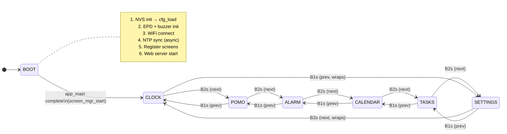

> **Direct jump** (web console / UART): `goto(id)` switches to any screen immediately.
> **Full EPD refresh** occurs on every screen transition.

---

## 2. Boot Sequence State

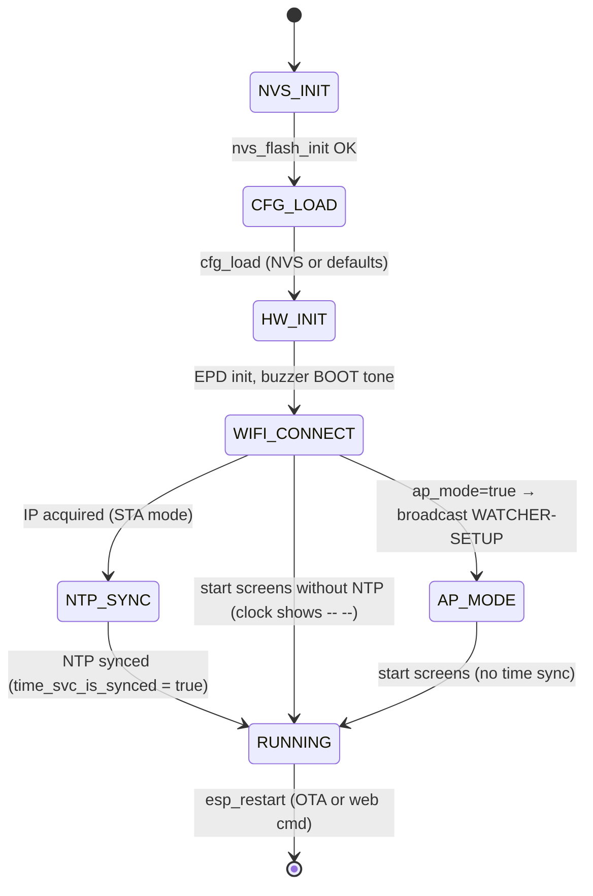

---

## 3. Clock Screen

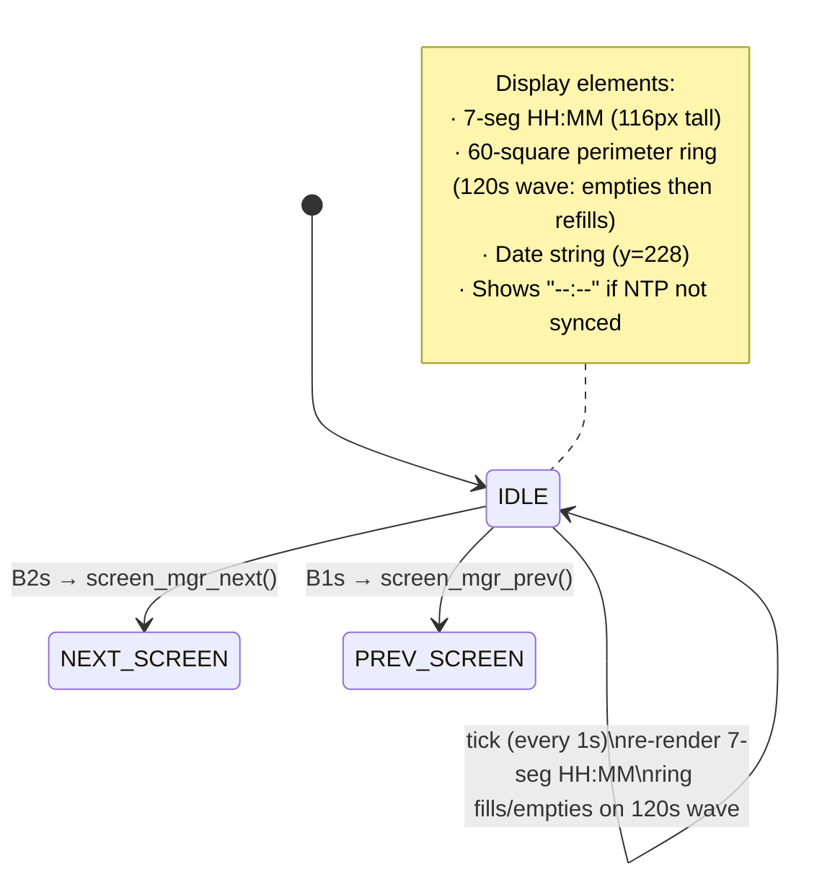

---

## 4. Pomodoro Screen

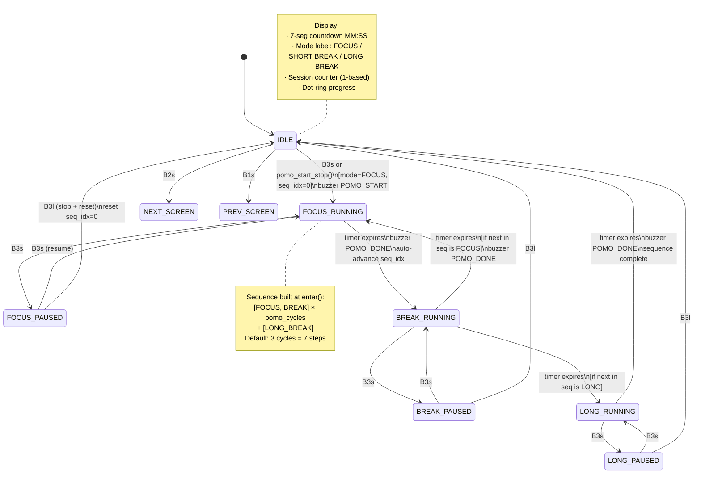

---

## 5. Alarm Screen

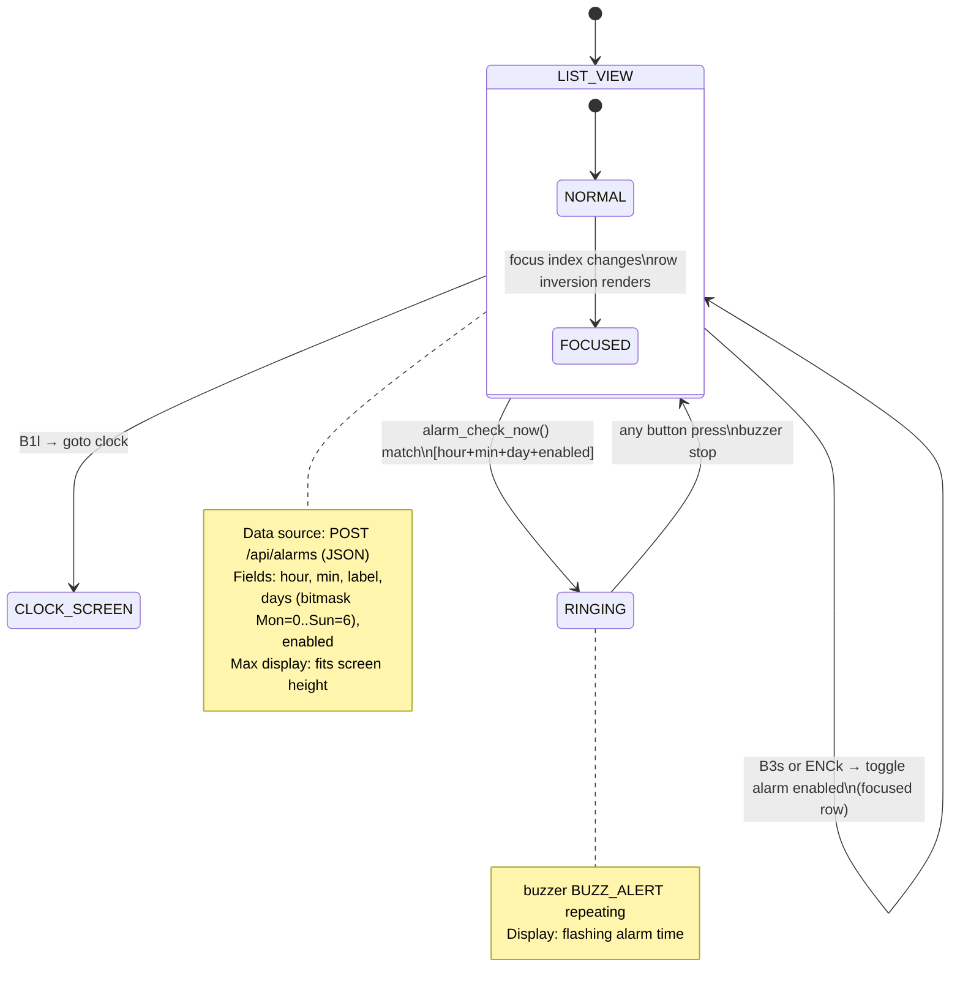

---

## 6. Tasks Screen

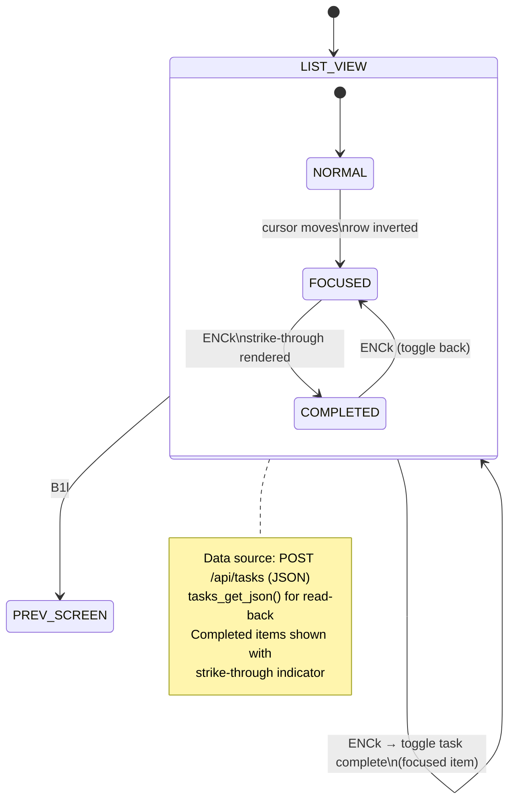

---

## 7. Settings Screen

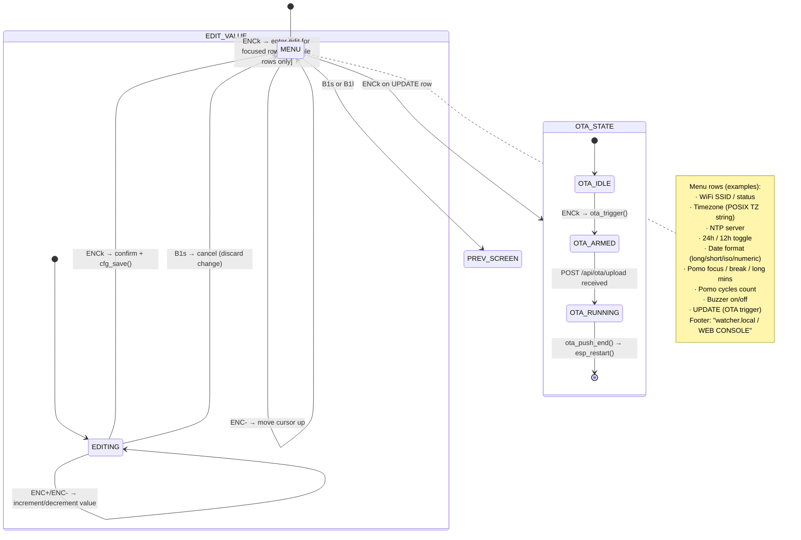

---

## 8. Calendar Screen

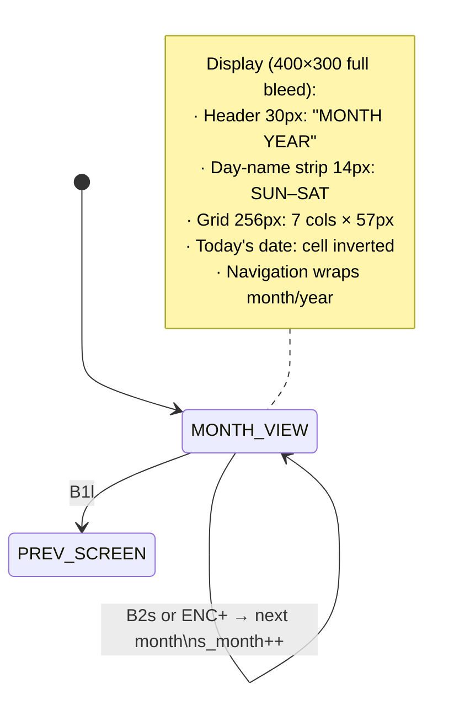

---

## 9. OTA Update State Machine

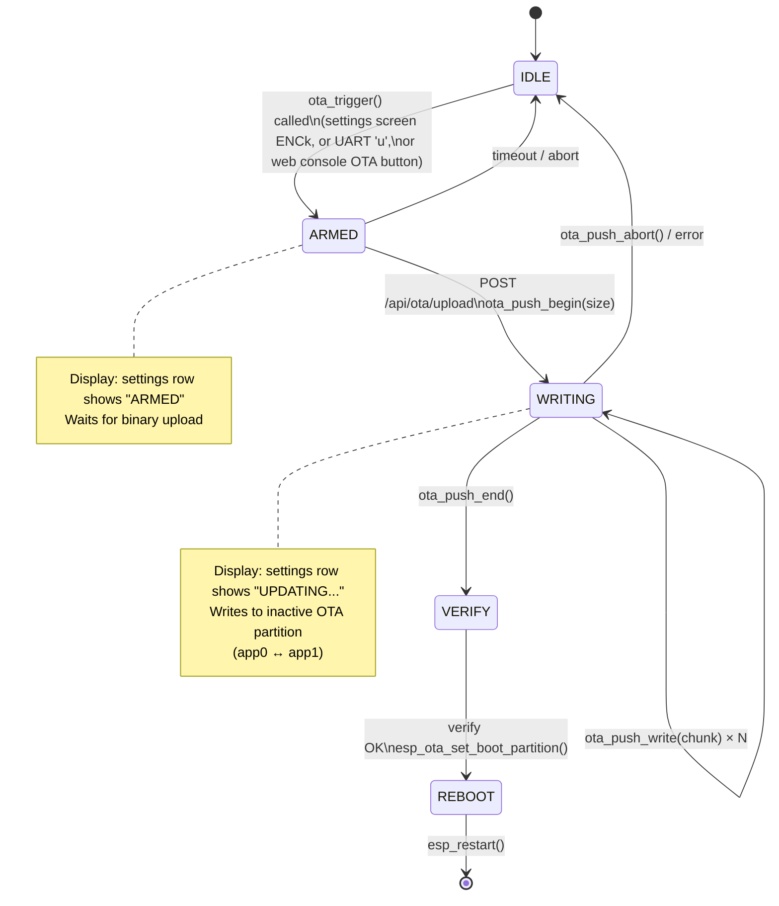

---

## 10. WiFi / NTP Lifecycle

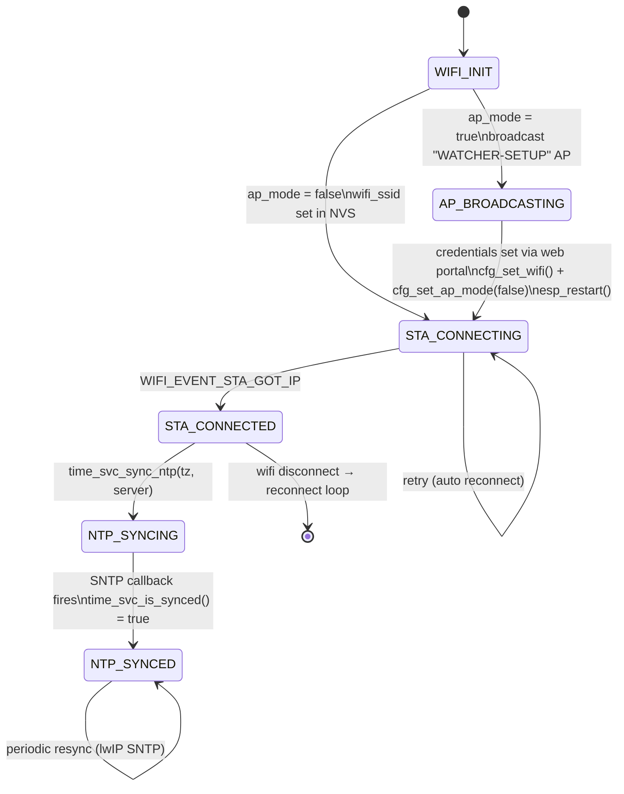

---

## 11. Web Console Input Simulation

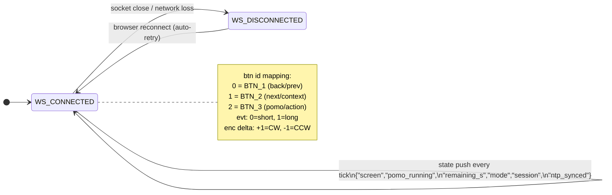

---

## 12. Complete System Overview

```mermaid
flowchart TD
    BOOT([Boot: NVS → cfg_load → HW init → WiFi → NTP])

    BOOT --> CLOCK

    subgraph SCREENS["Screen Navigation (cyclic B1s=prev, B2s=next)"]
        CLOCK["🕐 CLOCK\n7-seg HH:MM\n60-sq ring"]
        POMO["🍅 POMODORO\nFOCUS / BREAK / LONG\nDot-ring progress"]
        ALARM["⏰ ALARM\nList + toggle\nalarm_check_now()"]
        CAL["📅 CALENDAR\nMonth grid\nprev/next month"]
        TASKS["✓ TASKS\nScrollable list\ntoggle complete"]
        SETTINGS["⚙ SETTINGS\nMenu + edit\nOTA trigger"]
    end

    CLOCK --> POMO --> ALARM --> CAL --> TASKS --> SETTINGS --> CLOCK

    subgraph INPUTS["Input Sources"]
        BTN["Physical Buttons\nBTN_1/2/3 + ENC\n(ENABLE_INPUTS=1)"]
        WEB["Web Console\nWS virtual sim\ncb_btn / cb_enc"]
        UART["UART Serial\nn/p/[/]/e/+/r\n(ENABLE_INPUTS=0)"]
    end

    BTN --> SCREENS
    WEB --> SCREENS
    UART --> SCREENS

    subgraph SERVICES["Background Services"]
        NTP["time_svc\nNTP sync\nlocaltime_r"]
        WEBSVR["web_server\nHTTP + WS\n/api/* + /ws"]
        OTA["ota_task\nPush OTA\napp0↔app1"]
        CFG["config_store\nNVS-backed\nwatcher_cfg_t"]
    end

    SCREENS --> SERVICES
    SERVICES --> SCREENS

    subgraph DISPLAY["Display Pipeline"]
        FB["fb_t\n15KB 1-bit\n400×300"]
        EPD["SSD1683\nGDEY042T81\n4.2\" e-paper"]
    end

    SCREENS --> FB --> EPD

    BUZZ["Buzzer\nLEDC PWM\nnamed patterns"]
    SCREENS --> BUZZ
```
